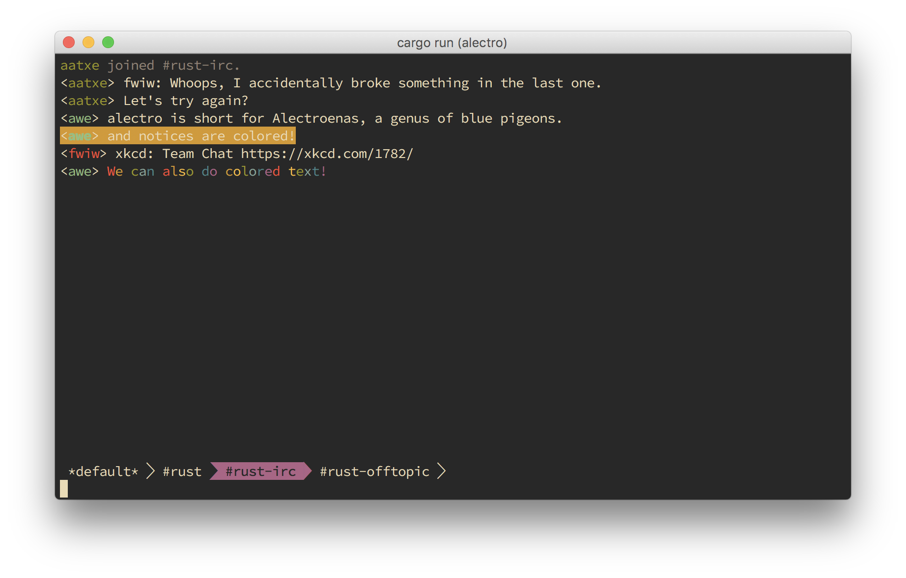

# alectro    #

A terminal IRC client in Rust. Very much a work in progress, and the screenshot below may not always be accurate.

## Acknowledgements ## 

* In its current state, a lot of the UI code is derived from [tui-rs](https://github.com/fdehau/tui-rs) by [Florian Dehau](http://fdehau.com).
